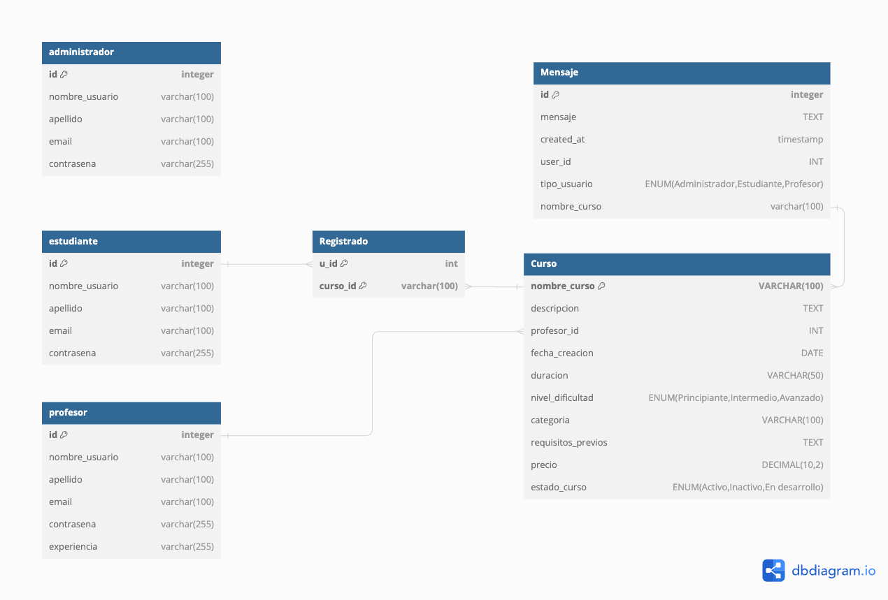

\newpage

\section*{Memoria de la estructura del proyecto}

## Introducción

Learnique se presenta como una innovadora plataforma de educación en línea diseñada para transformar el panorama actual del aprendizaje digital. Distinguiéndose por su enfoque en la personalización, Learnique no solo ofrece acceso a una amplia gama de recursos educativos, sino que también adapta la experiencia de aprendizaje a las necesidades individuales de cada usuario. A través de la implementación de tecnologías avanzadas, Learnique busca optimizar la retención de información y maximizar la satisfacción del estudiante, ofreciendo una solución integral que va más allá de la mera transmisión de conocimientos teóricos. Esta plataforma es el resultado de un meticuloso análisis de las limitaciones presentes en los modelos educativos en línea convencionales, marcando el comienzo de una era donde el aprendizaje digital es genuinamente inclusivo, accesible y efectivo para todos. 

### Tipos de Usuarios

Learnique atiende a una diversidad de usuarios, cada uno con distintas metas y necesidades educativas. A continuación, se describen los principales tipos de usuarios y las funcionalidades específicas diseñadas para cada grupo:

- Estudiantes:
Individuos que buscan expandir su conocimiento y habilidades en áreas específicas. Estos usuarios pueden acceder a cursos personalizados que se ajustan a su nivel de experiencia y ritmo de aprendizaje.

- Educadores:
Profesores y formadores que buscan complementar su material didáctico con recursos interactivos y actualizados. La plataforma permite a los educadores enriquecer su enseñanza con contenido diverso y herramientas de valuación avanzadas.

- Administradores:
Responsables de gestionar y supervisar la plataforma, asegurando que el contenido sea relevante, actualizado y de alta calidad. Los administradores también juegan un papel crucial en la moderación de la comunidad de usuarios, la implementación de mejoras basadas en la retroalimentación y el mantenimiento de la infraestructura técnica de Learnique.

\newpage

## Listado de scripts para las vistas

### Pagina Principal
- index.php : Pantalla principal de la página web. 

### Comun
- topBar.php : Cabecera de la web

- curso.php : Vista de un curso en particular. 

### Plantilla
- plantilla.php : Plantilla que será llamada por todas las vistas. 

### F1: Gestión de Roles: Estudiante, Profesor, Administrador
- login.php : Pantalla de login

- registro.php : Pantalla de registro

- logout.php : Pantalla de logout

### F2: Gestión de Inscripciones y Matriculaciones
- inscripcion.php : Pantalla de inscripción a un curso (se agrega el curso al carrito)

- carrito.php : Pantalla de carrito de compras 

### F3: Gestión de Búsqueda con Filtros
- cursos.php : Pantalla de listado de cursos. A partir de ahí, podemos seleccionar el curso para acceder a la información que deseamos.

  - trading.php : vista de el curso de trading 
  
  - blockchain.php : vista de el curso de blockchain
  
  - cripto.php : vista de el curso de criptomonedas 
  
  - marketing.php : vista de el curso de marketing
  
    
(estos cuatros cursos son ejemplos para entender lo que queremos hacer despues con la base de datos.)

- curso.php : vista para un curso en particular, va a reemplazar los 4 previos.

- buscar_cursos.php : Buscador de cursos.

### F4: Panel de Administración
- ajustes.php : En ajustes se podrá borrar usuarios y administrar cursos.

### F5: Gestión de Comunicación: Estudiantes y Profesores
- chat.php : Pantalla de chat

\vspace{12mm}

## Listado de scripts adicionales

- Clase de identidad de las tablas de la base de datos:

  - Admin.php

  - Estudiante.php

  - Profesor.php
  
  - Registrado.php
   
  - Curso.php
  
  
- Reorganización de la funcionalidad asociada a la gestión de los usuarios:

  - Usuario.php

- Centralización de la gestión de conexiones a bases de datos y otras operaciones de la aplicación. 

  - Aplicacion.php: 
  
- Reorganización de la gestión de formularios:

  - Formulario.php

  - FormurioInscripcion.php
  
  - FormularioLogin.php

  - FormularioRegistro.php
  

- Configuración e inicialización de la aplicación:

  - Config.php
  
- buscador.php

\newpage

## Estructura de la base de datos

{ width=85% }

La arquitectura de nuestra base de datos está meticulosamente diseñada para sustentar una plataforma educativa online que ofrece una experiencia integral tanto para estudiantes como para profesores. El diagrama adjunto proporciona una representación visual de las relaciones y los campos clave de la base de datos.

La tabla `estudiante` almacena los datos esenciales del usuario, incluyendo un identificador único `id`, el `nombre_usuario`, `apellido`, `email`, y una `contraseña` segura. Esta tabla es fundamental para la gestión de cuentas y la personalización de la experiencia del usuario.

Paralelamente, la tabla `profesor` captura información detallada de los educadores en la plataforma, como sus credenciales de acceso, `experiencia` profesional y especializaciones. El vínculo entre los cursos y los profesores se establece mediante un campo de clave foránea `profesor_id` que conecta con el identificador único del profesor.

Los cursos se detallan en la tabla `curso`, que incluye un nombre descriptivo, `nombre_curso`, una `descripcion` extensa del contenido, `fecha_creacion`, `duracion` estimada, y un `nivel_dificultad` que clasifica el curso. Además, cada curso tiene asignado una `categoria`, `requisitos_previos` necesarios para el alumno y un `precio`, además de un estado (`estado_curso`) que indica si está activo, inactivo o en desarrollo.

Para gestionar las inscripciones, disponemos de la tabla `Registrado`, que establece una relación entre los estudiantes y los cursos a los que se han inscrito, mediante los campos `u_id` y `curso_id`. Esta tabla es crucial para el seguimiento de las inscripciones activas y el acceso a los contenidos del curso.

Por último, la tabla `comentarios` permite a los estudiantes y profesores interactuar y discutir dentro del contexto de un curso, facilitando el intercambio de conocimientos y opiniones. Registra el `u_id` y `curso_id` correspondiente, junto con la `fecha` del comentario y su `contenido`.

\newpage

## Prototipo funcional del proyecto

### Profesores:

| nombre de usuario | apellido | email                     | contraseña | experiencia |
|-------------------|----------|---------------------------|------------|-------------|
| javier            | bravo    | javier@learnique.edu      | javier1    |     alta    |
| eva               | ullan    | eva@learnique.edu         | eva12      |     alta    |

### Estudiantes:

| nombre de usuario | apellido | email                     | contraseña |
|-------------------|----------|---------------------------|------------|
| azul              | noguera  | azul@learnique.edu        | azul1      |
| rocio             | gonzalez | rocio@learnique.edu       | rocio1     |
| patricio          | guledjian| patricio@learnique.edu    | patricio1  |
| gabriel           | zamy     | gabriel@learnique.edu     | gabriel1   |
| vincent           | jansou   | vincent@learnique.edu     | vincent1   |

### Administradores:

| nombre de usuario | apellido | email                     | contraseña |
|-------------------|----------|---------------------------|------------|
| admin             | admin    | admin@learnique.edu       | admin1     |

\newpage

## VPS

\vspace{5mm}

URL al servicio de Guacamole:

[https://vm013.containers.fdi.ucm.es/](https://vm013.containers.fdi.ucm.es/)

- Usuario: vm013

- Contraseña: UEp7y90WZsGqKUtAG_J8

\newpage

## Actividades de los integrantes

### Azul Noguera
- Style.css
- index.php estructura 
- Creación de la memoria
- Ordenamiento de las carpetas y los ficheros
- Contribución en carpeta mysql
- Contribución a diagrama de estructura de base de datos
- Contribución a la configuración del VPS

### Rocio Gonzalez
- leeme.txt
- Contribución en registro de usuarios
- Contribución a carpeta mysql
- Contribución a gestión de busqueda de cursos
- Contribución a panel de administración
- Contribución a la gestión de inscripciones y matriculación

### Patricio Guledjian
- Contribución a gestión de busqueda de cursos 
- Contribución a panel de administración
- Contribución al style.css
- Contribución en la carpeta mysql 

### Vincent Jasou
- Validación de ficheros php
- Contribución a registro de usuarios
- Reorganización del codigo en clases
- Contribución a gestión de busqueda de cursos
- Contribución a panel de administración
- Contribución a la configuración del VPS

### Gabriel Zamy
- Contribución a diagrama de estructura de base de datos
- Contribución en carpeta mysql
- Reorganización del codigo en clases
- Contribución a la gestión de inscripciones y matriculación
- Contribución a la configuración del VPS

