\newpage

\section*{Memoria de la estructura del proyecto}

## Introducción

Learnique se presenta como una innovadora plataforma de educación en línea diseñada para transformar el panorama actual del aprendizaje digital. Distinguiéndose por su enfoque en la personalización, Learnique no solo ofrece acceso a una amplia gama de recursos educativos, sino que también adapta la experiencia de aprendizaje a las necesidades individuales de cada usuario. A través de la implementación de tecnologías avanzadas, Learnique busca optimizar la retención de información y maximizar la satisfacción del estudiante, ofreciendo una solución integral que va más allá de la mera transmisión de conocimientos teóricos. Esta plataforma es el resultado de un meticuloso análisis de las limitaciones presentes en los modelos educativos en línea convencionales, marcando el comienzo de una era donde el aprendizaje digital es genuinamente inclusivo, accesible y efectivo para todos. 

### Tipos de Usuarios

Learnique atiende a una diversidad de usuarios, cada uno con distintas metas y necesidades educativas. A continuación, se describen los principales tipos de usuarios y las funcionalidades específicas diseñadas para cada grupo:

- Estudiantes:
Individuos que buscan expandir su conocimiento y habilidades en áreas específicas. Estos usuarios pueden acceder a cursos personalizados que se ajustan a su nivel de experiencia y ritmo de aprendizaje.

- Educadores:
Profesores y formadores que buscan complementar su material didáctico con recursos interactivos y actualizados. La plataforma permite a los educadores enriquecer su enseñanza con contenido diverso y herramientas de valuación avanzadas.

- Administradores:
Responsables de gestionar y supervisar la plataforma, asegurando que el contenido sea relevante, actualizado y de alta calidad. Los administradores también juegan un papel crucial en la moderación de la comunidad de usuarios, la implementación de mejoras basadas en la retroalimentación y el mantenimiento de la infraestructura técnica de Learnique.

\newpage

## Descripción Detallada de la Aplicación Web 

Nuestra plataforma de educación en línea ofrece una amplia gama de funciones diseñadas para mejorar la experiencia de aprendizaje y facilitar la gestión educativa. A continuación, describimos en detalle las características clave de la aplicación acompañadas de capturas de pantalla para una mejor comprensión.

### Pantalla de Inicio

Al acceder a la aplicación, el usuario se encuentra con la pantalla de inicio, que proporciona una visión general de la plataforma y una descripción de los cursos que se ofrecen. Un botón destacado, "Ver todos los cursos", permite explorar todas las opciones disponibles.

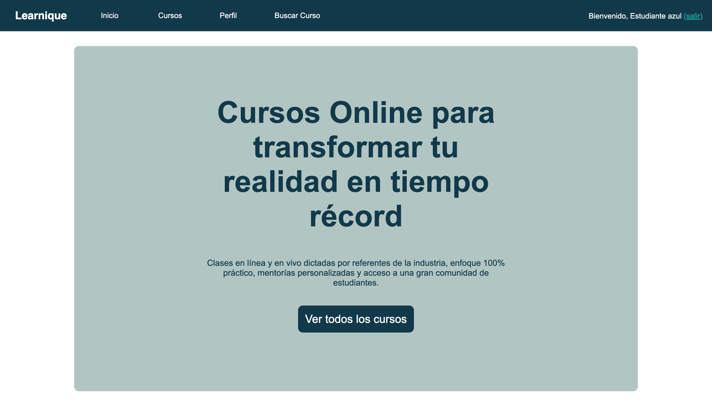{width=70%}

### Pantallas de Registro y Log In

La aplicación cuenta con pantallas separadas para registro y logIn. Los usuarios pueden registrarse o iniciar sesión como estudiantes, profesores o administradores, según su rol correspondiente.

- Pantalla de Registro: Aquí, los nuevos usuarios pueden crear una cuenta.

- Pantalla de LogIn: Los usuarios registrados pueden acceder a su cuenta.

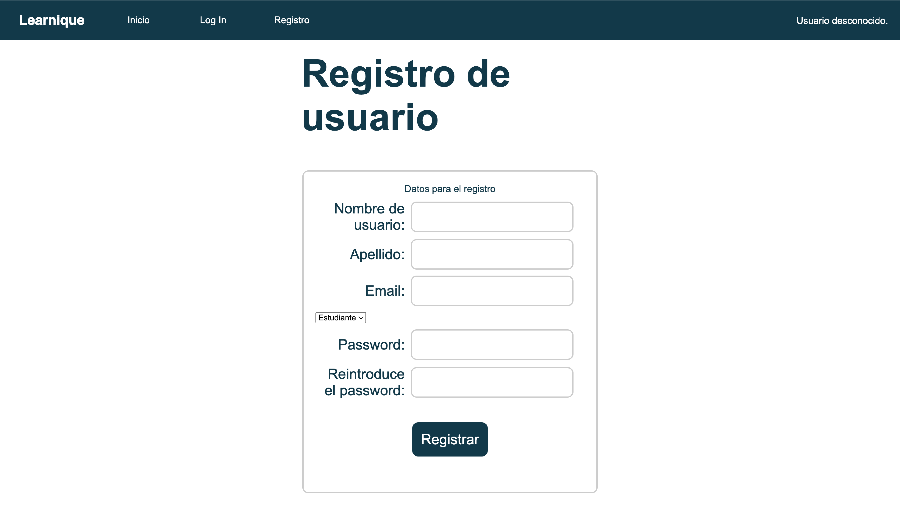{width=50%}
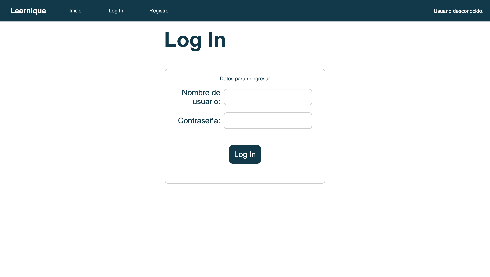{width=50%}

### Perfil, Búsqueda de Curso e Inscripción (Estudiante)

Una vez que un usuario se identifica como estudiante, obtiene acceso a las siguientes pantallas:

- Inicio: Panel general de la actividad en la plataforma.
- Cursos: Vista y gestión de todos los cursos disponibles.

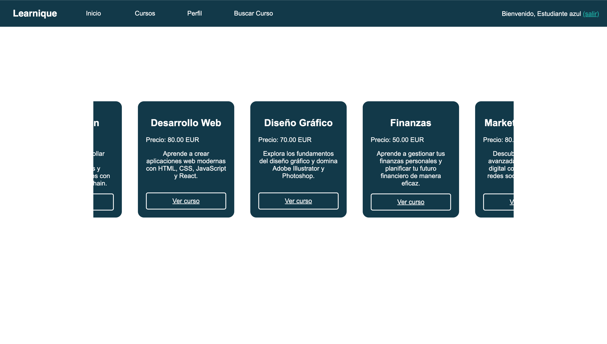{width=70%}

- Perfil: El estudiante puede ver y editar su información personal, además de revisar los cursos en los que está inscrito.

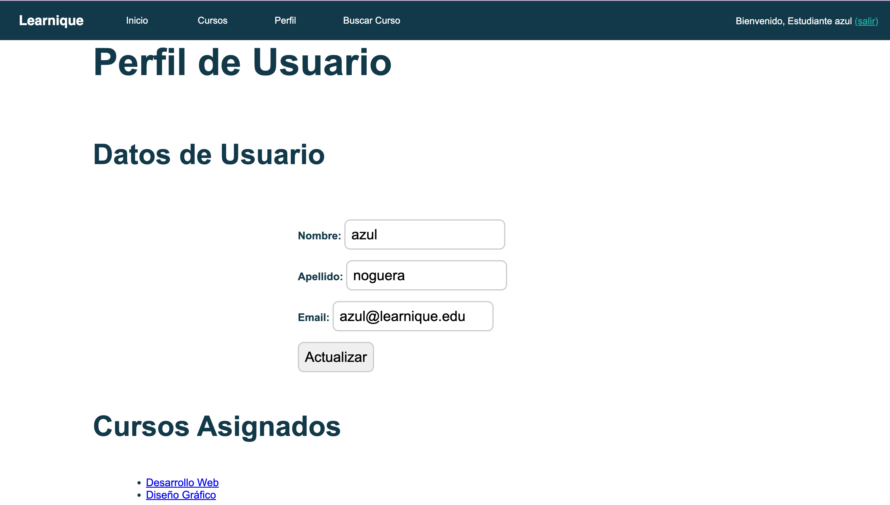{width=70%}

- Buscar Curso: Se pueden buscar cursos utilizando filtros como nombre o precio.

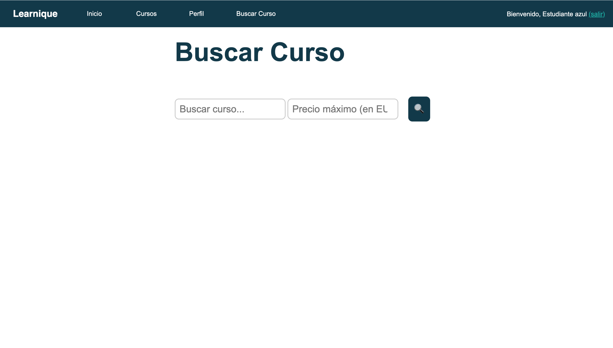{width=70%}

- Detalle de Cursos: Se pueden ver el contenido del curso. 

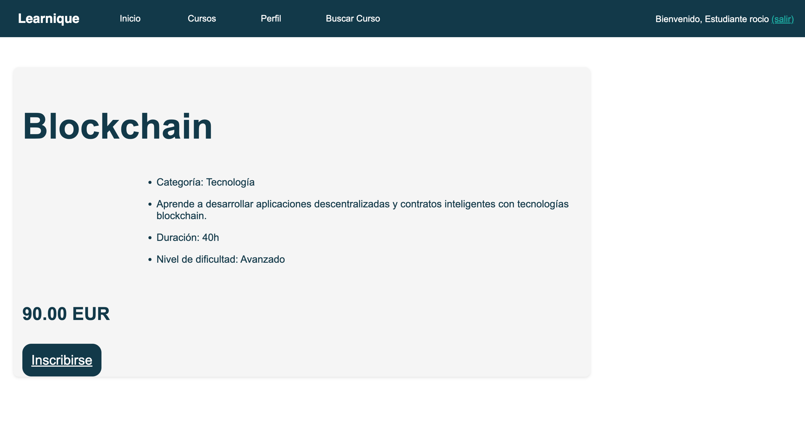{width=70%}

- Inscripción a Cursos: Te puedes inscribir al curso que más te guste. 

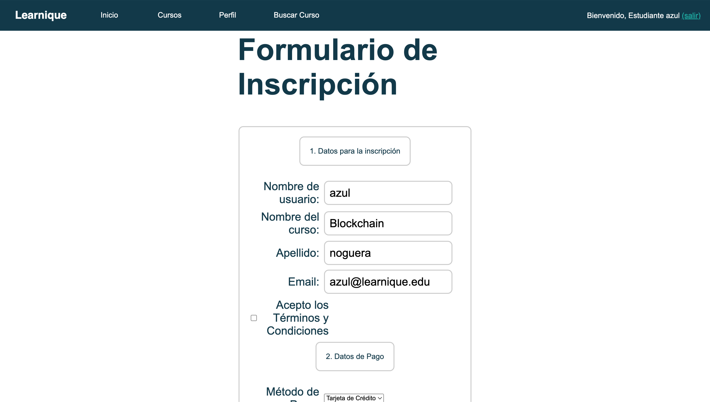{width=70%}

- Chat: Acceso a chat con profesores si el alumno esta inscripto en el un curso.

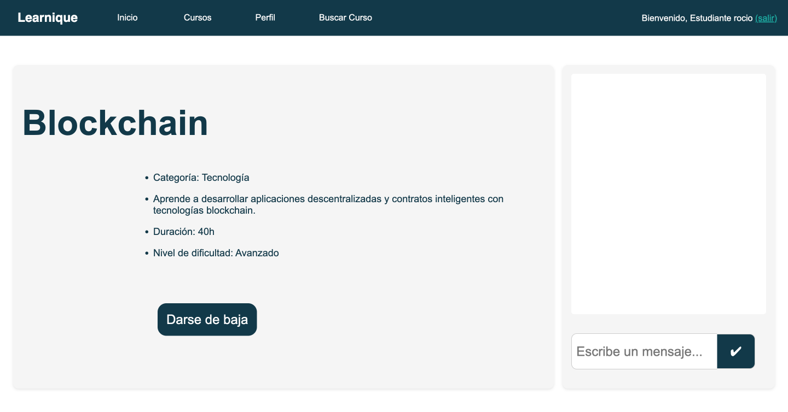{width=70%}

### Mis Cursos y Mis Alumnos (Profesor)

Los profesores tienen acceso a las siguientes pantallas:

- Inicio: Panel general de la actividad en la plataforma.
- Mis Cursos: Listado de cursos que el profesor imparte.

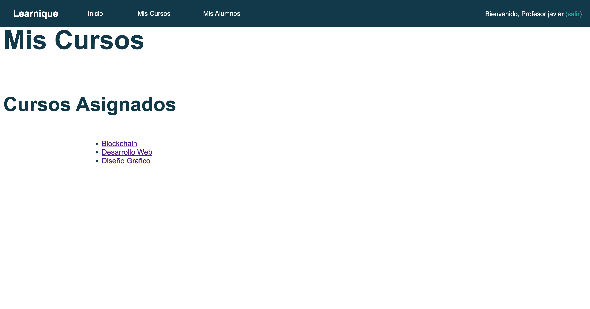{width=70%}

- Mis Alumnos: Gestión de estudiantes inscritos en los cursos del profesor.

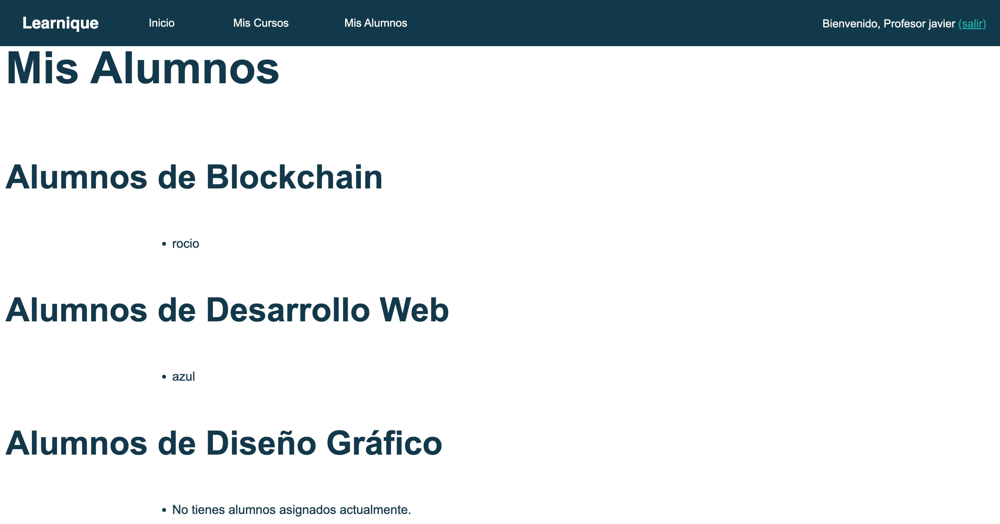{width=70%}

### Funcionalidades del Administrador

Los administradores tienen acceso a un conjunto completo de herramientas para gestionar la plataforma, incluyendo:

- Inicio: Panel general de la actividad en la plataforma.
- Cursos: Vista y gestión de todos los cursos disponibles.
- Ajustes: Panel de administración de la base de datos, permitiendo:
  - Eliminar usuarios.
  - Cambiar roles de usuarios.
  - Agregar curso. 
  - Editar curso.
  - Eliminar cursos.
  
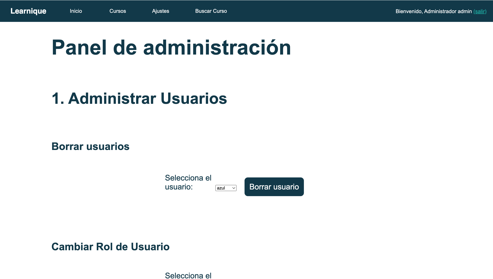{width=70%}

- Buscar Curso: Búsqueda de cursos por nombre o precio, similar a la funcionalidad disponible para los estudiantes.

Conclusión

La aplicación web de educación en línea está diseñada para ofrecer una experiencia completa tanto a estudiantes como a profesores y administradores. Las capturas de pantalla presentadas demuestran cómo cada tipo de usuario puede interactuar de manera eficiente con las distintas funcionalidades, contribuyendo así a una gestión y un aprendizaje óptimos.

\newpage

## Listado de scripts para las vistas

### Pagina Principal
- index.php : Pantalla principal de la página web. 

### Comun
- topBar.php : Cabecera de la web

- curso.php : Vista de un curso en particular. 

### Plantilla
- plantilla.php : Plantilla que será llamada por todas las vistas. 

### F1: Gestión de Roles: Estudiante, Profesor, Administrador
- login.php : Pantalla de login.

- registro.php : Pantalla de registro.

- logout.php : Pantalla de logout.

- perfil.php : Pantalla de perfil de usuario.

- mis_alumnos.php : Pantalla de alumnos de un profesor.

- mis_cursos.php : Pantalla de cursos que dicta un profesor.

### F2: Gestión de Inscripciones y Matriculaciones
- inscripcion.php : Pantalla de inscripción a un curso.

- darseDeBaja.php : Pantalla de desinscripcion de un curso.

### F3: Gestión de Búsqueda con Filtros
- cursos.php : Pantalla de listado de cursos. A partir de ahí, podemos seleccionar el curso para acceder a la información que deseamos.

- curso.php : vista para un curso en particular.

- buscar_cursos.php : Buscador de cursos.

### F4: Panel de Administración
- ajustes.php : En ajustes se podrá borrar usuarios, cambiar roles de usuario y crear, editar o borrar cursos.

- actualizar_curso.php: Gestiona la actualización de un curso.

- agregar_curso.php: Gestiona la creación de un curso.

### F5: Gestión de Comunicación: Estudiantes y Profesores
- chat.php : Pantalla de chat

\vspace{12mm}

## Listado de scripts adicionales

- Clase de identidad de las tablas de la base de datos:

  - Admin.php

  - Estudiante.php

  - Profesor.php
  
  - Registrado.php
   
  - Curso.php

  - Mensaje.php
  
- Reorganización de la funcionalidad asociada a la gestión de los usuarios:

  - Usuario.php

- Centralización de la gestión de conexiones a bases de datos y otras operaciones de la aplicación. 

  - Aplicacion.php
  
- Reorganización de la gestión de formularios:

  - Formulario.php

  - FormurioInscripcion.php
  
  - FormularioLogin.php

  - FormularioRegistro.php
  
  - FormularioAgregarCurso.php

- Configuración e inicialización de la aplicación:

  - Config.php
  
- buscador.php
- procesarActualizarPerfil.php

\newpage

## Estructura de la base de datos

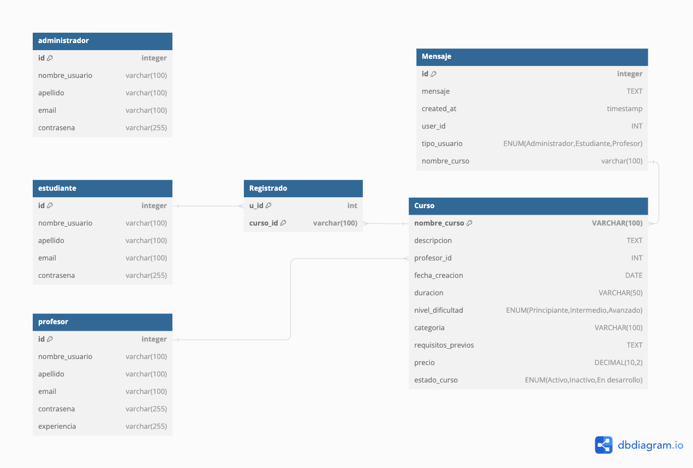{ width=85% }

La arquitectura de nuestra base de datos está meticulosamente diseñada para sustentar una plataforma educativa online que ofrece una experiencia integral tanto para estudiantes como para profesores. El diagrama adjunto proporciona una representación visual de las relaciones y los campos clave de la base de datos.

La tabla `estudiante` almacena los datos esenciales del usuario, incluyendo un identificador único `id`, el `nombre_usuario`, `apellido`, `email`, y una `contraseña` segura. Esta tabla es fundamental para la gestión de cuentas y la personalización de la experiencia del usuario.

Paralelamente, la tabla `profesor` captura información detallada de los educadores en la plataforma, como sus credenciales de acceso, `experiencia` profesional y especializaciones. El vínculo entre los cursos y los profesores se establece mediante un campo de clave foránea `profesor_id` que conecta con el identificador único del profesor.

Los cursos se detallan en la tabla `curso`, que incluye un nombre descriptivo, `nombre_curso`, una `descripcion` extensa del contenido, `fecha_creacion`, `duracion` estimada, y un `nivel_dificultad` que clasifica el curso. Además, cada curso tiene asignado una `categoria`, `requisitos_previos` necesarios para el alumno y un `precio`, además de un estado (`estado_curso`) que indica si está activo, inactivo o en desarrollo.

Para gestionar las inscripciones, disponemos de la tabla `registrado`, que establece una relación entre los estudiantes y los cursos a los que se han inscrito, mediante los campos `u_id` y `curso_id`. Esta tabla es crucial para el seguimiento de las inscripciones activas y el acceso a los contenidos del curso.

Por último, la tabla `mensaje` en esta base de datos registra mensajes enviados por usuarios relacionados con cursos específicos en un entorno educativo. Cada mensaje está identificado por un número único `id` y contiene el contenido del mensaje (`mensaje`), la fecha y hora de creación (`created_at`), el usuario que envió el mensaje (`user_id`) y su tipo (`tipo_usuario`), que puede ser 'Administrador', 'Estudiante' o 'Profesor'. Además, cada mensaje está asociado a un curso específico (`nombre_curso`) a través de una clave externa que referencia la tabla Curso. 

\newpage

## Prototipo funcional del proyecto

### Profesores:

| nombre de usuario | apellido | email                     | contraseña | experiencia |
|-------------------|----------|---------------------------|------------|-------------|
| javier            | bravo    | javier@learnique.edu      | javier1    |     alta    |
| eva               | ullan    | eva@learnique.edu         | eva12      |     alta    |

### Estudiantes:

| nombre de usuario | apellido | email                     | contraseña |
|-------------------|----------|---------------------------|------------|
| azul              | noguera  | azul@learnique.edu        | azul1      |
| rocio             | gonzalez | rocio@learnique.edu       | rocio1     |
| patricio          | guledjian| patricio@learnique.edu    | patricio1  |
| gabriel           | zamy     | gabriel@learnique.edu     | gabriel1   |
| vincent           | jansou   | vincent@learnique.edu     | vincent1   |

### Administradores:

| nombre de usuario | apellido | email                     | contraseña |
|-------------------|----------|---------------------------|------------|
| admin             | admin    | admin@learnique.edu       | admin1     |

\newpage

## VPS

\vspace{5mm}

URL al servicio de Guacamole:

[https://vm013.containers.fdi.ucm.es/](https://vm013.containers.fdi.ucm.es/)

- Usuario: vm013

- Contraseña: UEp7y90WZsGqKUtAG_J8

\newpage

## Actividades de los integrantes

### Azul Noguera
- Style.css
- index.php estructura 
- Creación de la memoria
- Ordenamiento de las carpetas y los ficheros
- Contribución en carpeta mysql
- Contribución a diagrama de estructura de base de datos
- Contribución a la configuración del VPS
- Sanitización de entrada y salida de documentos
- Corrección de errores practica anterior

### Rocio Gonzalez
- leeme.txt
- Contribución a Gestión de Roles: Estudiante, Profesor, Administrador
- Contribución a carpeta mysql
- Contribución a gestión de busqueda de cursos
- Contribución a panel de administración
- Contribución a la gestión de inscripciones y matriculación
- Contribución en la memoria
- Corrección de errores practica anterior

### Patricio Guledjian
- Contribución a panel de administración
- Contribución al style.css
- Contribución en la carpeta mysql
- Contribución en Gestión de Inscripciones y Matriculaciones
- Contribución en Gestión de Búsqueda con Filtros
- Corrección de errores practica anterior

### Vincent Jasou
- Validación de ficheros php
- Contribución a registro de usuarios
- Reorganización del codigo en clases
- Contribución a gestión de busqueda de cursos
- Contribución a panel de administración
- Contribución a la configuración del VPS
- Contribución a la Gestión de Comunicación (chat)
- Corrección de errores practica anterior

### Gabriel Zamy
- Contribución a diagrama de estructura de base de datos
- Contribución en carpeta mysql
- Reorganización del codigo en clases
- Contribución en Gestión de Inscripciones y Matriculaciones
- Contribución a la configuración del VPS
- Contribución en Gestión de Búsqueda con Filtros

